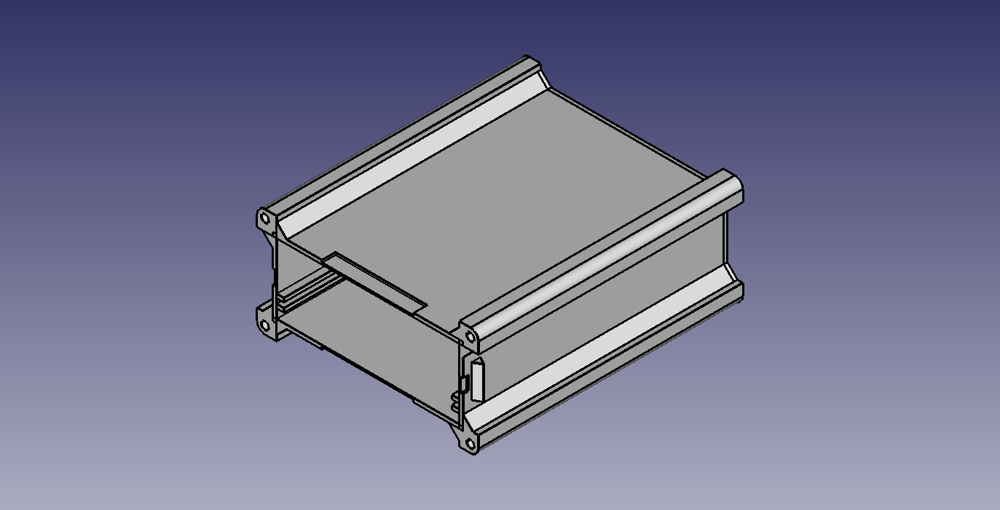
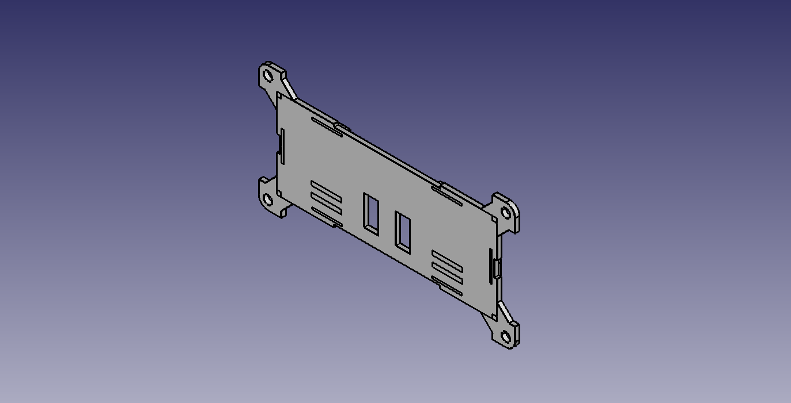
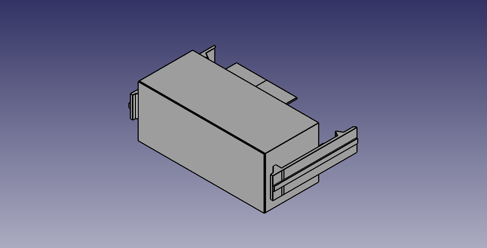
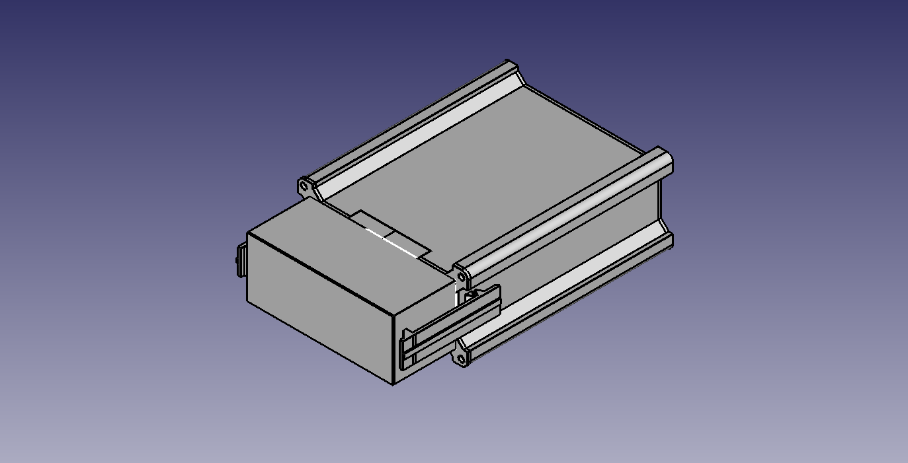

# Enclosure

 The enclosure consists of 3 parts:
 
 1. base
 
 
 
 2. mechanical lid
 
  
 
 3. electrode lid
 
  
 
 They all can be 3D printed and barely require support material, if any. 
 
 
 
 # Parameters
 
 The FreeCAD file comes in a fully parametrised package. In the file you can find "Parameters" spreadsheet which contains almost all the desired geometrical dependencies.
 Thus, it is possible to customise the enclosure for your specific use. Moreover, it is relatively easy to limit the enclosure to the use of just two parts: the base and either one of lids.
 
 Most importantly, it is possible to vary the thickness and tolerances (both mechanical tolerances of the PCB and the 3D printer)
 
 # Fabrication
 
 Ultimaker S5 with UltraFuse transparent PET were used to fabricate the prototype. LEDs should still be visible even if the enclosure is printed with opaque filament. The front LED has enough space
 for it and the charging LED should still be visible through small gaps near the USB connector and the back of the enclosure.