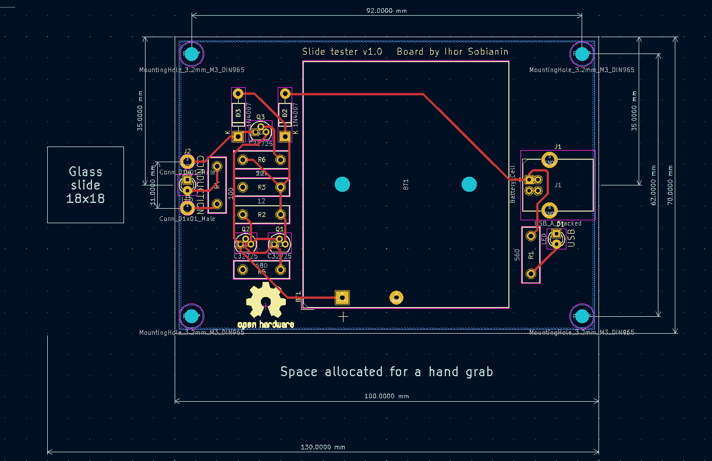
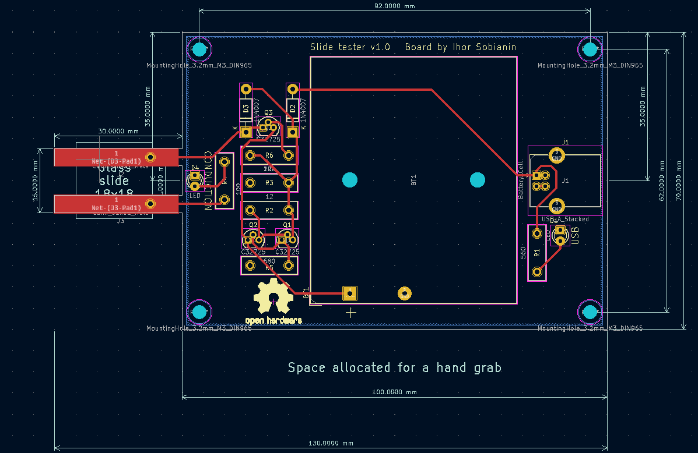
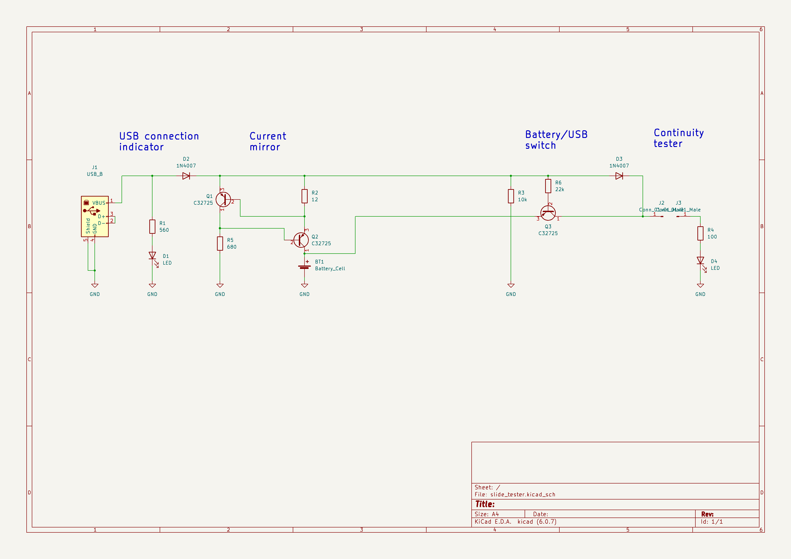

# Printed circuit boards

There are two available printed circuit board (PCB) designs. One features two plated through holes (PTH) which need to be soldered with a copper wire to create electrodes. This PCB is easier in manufacturing and handling.

 

The other PCB design features two dedicated electrodes. The issue with this design, which is the original design, is that you need to explicitly specify to the manufacturer that these electrodes must cover
the whole area without any solder mask left on electrode pads. Otherwise, the solder mask is going to be taller than electrodes and a slide might not be able to touch the pads. Yet, this version also has PTH as a back-up.

 

Both use USB B connector for charging but feel free to swap those for whatever suits you.

# Bill of Materials

Components used:

Resistors

- 12 $\Omega$
- 100 $\Omega$
- 560 $\Omega$
- 680 $\Omega$
- 10k $\Omega$
- 22k $\Omega$

Diodes

- 2x 1n4007

LEDs

- 5 mm Green LED
- 5 mm Red LED

Transistors

- 3x C32725

Miscellaneous

- USB B connector
- 3x AA batteries
- 3x AA battery holder
- USB A to USB B cable

# Cicruitry

From the perpective of circuit design, the modus operandi is simple. When USB is connected, it set up the current mirror. Resistor R2 value is picked up to allow about 50 mA to pass through the Q2 transistor
into the batteries thus charging them. In the same time, Q3 acts as a switch and restricts current from flowing from the batteries while USB is connected and the tested D4 LED lights up using energy only from
the connector. When USB is disconnected, Q3 conducts and batteries are used to test slides.

 

A highlight of this circuit is extensive use of C32725 transistors without use of any other components which makes it cheaper and more accessible.